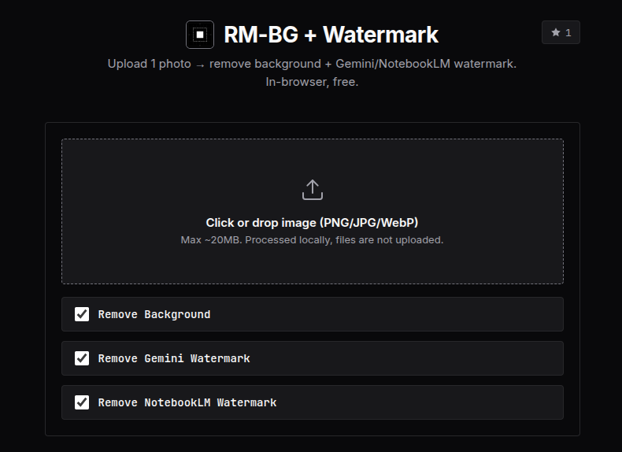
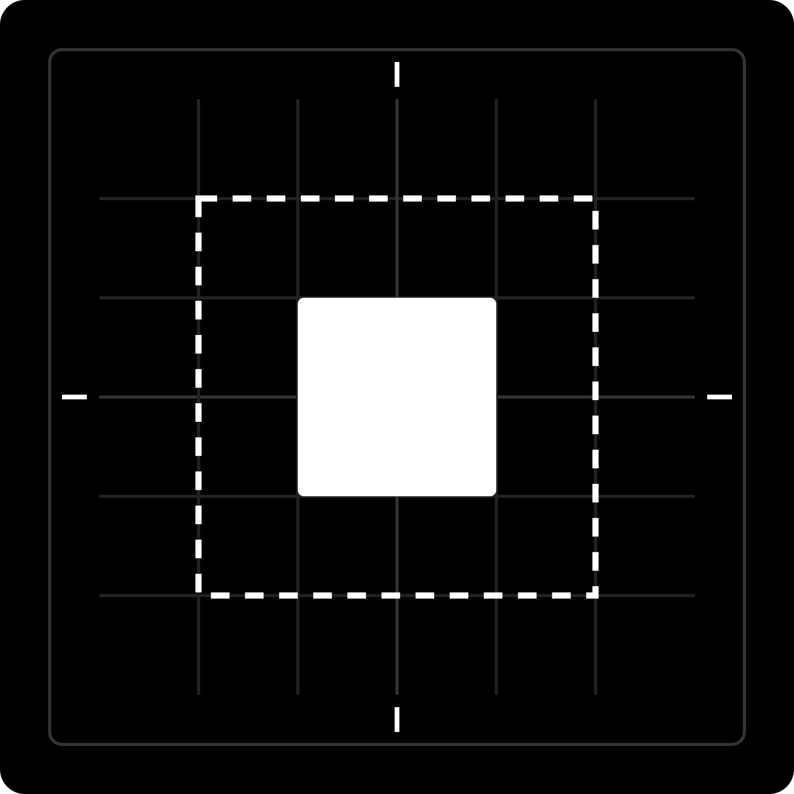
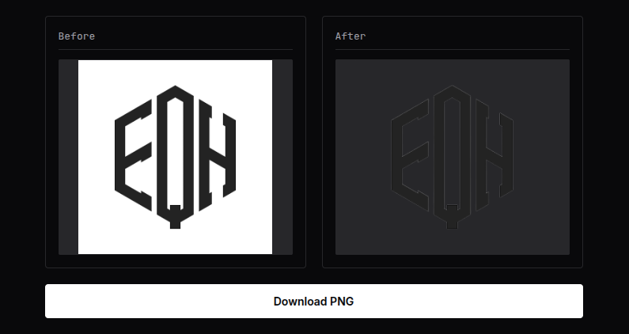

<p align="center"></p>

<p align="center"></p>

<h1 align="center">RM-BG + Watermark</h1>
<p align="center">
  <strong>Web Utility to Remove Background & Strip AI Watermarks</strong>
</p>

<p align="center">
  <a href="https://rm-bg.curzy.dev/"><strong>🌐 Live Website</strong></a>
</p>

<div align="center">

  <a href="https://github.com/Curzyori/rm-bg"></a>
  <a href="https://github.com/Curzyori/rm-bg/network/members"></a>
  <a href="https://github.com/Curzyori/rm-bg/blob/main/LICENSE"></a>
  

</div>

<p align="center">
  <a href="#why">Why</a> ·
  <a href="#key-features">Features</a> ·
  <a href="#tech-stack">Tech Stack</a> ·
  <a href="#architecture">Architecture</a> ·
  <a href="#quick-start">Quick Start</a> ·
  <a href="#installation">Installation</a> ·
  <a href="#preview">Preview</a> ·
  <a href="#support">Support</a> ·
  <a href="#license">License</a>
</p>

<p align="center">
  🌐 支持 4+ 种语言 —
  <a href="README.md">🇺🇸 EN</a> ·
  <a href="README_ID.md">🇮🇩 ID</a> ·
  <a href="README_CN.md"><b>🇨🇳 CN</b></a> ·
  <a href="README_JP.md">🇯🇵 JP</a>
</p>

---

## <a id="why"></a>🕒 为什么选择 RM-BG？

在浏览器中本地去除图像背景并清除 Gemini / NotebookLM 水印。非常适合清理 AI 生成的资产、制作透明背景图像或提取产品主体。完全在本地设备运行——图片绝不会上传到服务器。

|                              |                                                              |
| ----------------------------- | ------------------------------------------------------------ |
| ✅ **背景去除**              | 本地运行的 ISNet 模型，直接在浏览器中处理 |
| ✅ **Gemini 水印**           | 使用 canvas 提取技术去除 AI 水印 |
| ✅ **NotebookLM 水印**       | 独立支持 NotebookLM 导出的图像格式 |
| ✅ **100% 客户端运行**       | 无服务器，无需上传 — 绝对隐私安全 |
| ✅ **完全免费且无限制**      | 无需额度，无需账号，无任何限制 |

## <a id="key-features"></a>🎯 主要功能

| 功能 | 状态 | 描述 |
| :--- | :---: | :--- |
| **背景去除** | ✅ | 使用 ISNet 模型进行标准的背景抠图 |
| **Gemini 水印** | ✅ | 清除 Gemini 导出的 SynthID 水印 |
| **NotebookLM 水印** | ✅ | 清除 NotebookLM 导出的页脚水印 |
| **100% 客户端运行** | ✅ | 所有处理都在页面内进行，无需网络传输 |
| **多语言界面** | ✅ | 支持 EN、ID、CN、JP 一键切换 |
| **深色/浅色主题** | ✅ | 支持自动保存的主题切换 |

## <a id="tech-stack"></a>技术栈

- Vite 8 (rolldown)
- `@imgly/background-removal` (ONNX WebGPU/WASM)
- 基于 canvas 的自研水印引擎
- 原生 JS，无框架

## <a id="architecture"></a>🏗️ 架构

```
rm-bg/
├── index.html            # 首页 & 图片背景去除
├── video.html            # 视频背景去除页面
├── src/
│   ├── main.js           # 图片模块 UI + 引擎初始化
│   ├── video-main.js     # 视频模块 UI + 引擎初始化
│   └── lib/gemini-wm/    # 水印去除引擎
│       ├── core/          # 检测管道、处理
│       ├── video/         # Veo AI 视频水印检测
│       ├── sdk/           # 浏览器 & Node SDK
│       └── workers/       # 后台 Web Worker
├── public/
│   ├── logo.png
│   └── models/           # ONNX 去噪模型 (FDCNN)
├── images/               # README 截图
├── vite.config.js
└── package.json
```

## <a id="quick-start"></a>🚀 快速开始

直接在浏览器中打开：

<p align="center"><a href="https://rm-bg.curzy.dev/"><strong>🌐 rm-bg.curzy.dev</strong></a></p>

## <a id="installation"></a>📦 安装

```bash
git clone https://github.com/Curzyori/rm-bg.git
cd rm-bg
npm install
npm run dev
```

## <a id="preview"></a>预览

<div align="center">

| 首页 | 处理前后 |
|------|----------|
|  |  |

</div>

## <a id="support"></a>☕ 支持

如果你觉得这个项目对你有帮助，请考虑给一个 ⭐ Star 或 🍴 Fork 以示支持，这能让我更有动力继续开发更多有趣的开源项目！每一个 Star 和 Fork 对开发者来说都无比珍贵。

您的捐赠能让这个项目保持免费与开源。每一份贡献都至关重要，您的支持也将激励我未来继续开发更多有趣的开源项目。

<a href="https://donate.curzy.dev/">
  
</a>

## <a id="license"></a>许可证

MIT - 详见 <a href="https://github.com/Curzyori/rm-bg/blob/main/LICENSE">LICENSE</a>。

注意：`@imgly/background-removal` 依赖采用 AGPL-3.0 许可证。参见 <a href="https://github.com/imgly/background-removal-js">imgly/background-removal-js</a>。

<p align="center">
  <sub>作为 50 Projects Challenge 的第 20 个项目，由 **@Curzyori** 用心打造</sub>
</p>
